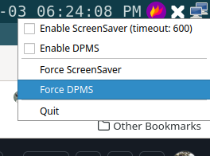

# pxsstray : Python XSet S Tray 

This is a small utility that provides a `pxsstray` script command which creates a tray icon with right click context menu you can use to enable or disable the X display screensaver or DPMS.



## Installation

```
pip install --upgrade pxsstray
```

### pyenv

If using pyenv, you can use the following command to find the location of pxsstray on your system

```
pyenv which pxsstray
```

Then add the following line (adjusting based on output from above) to the end of your `~/.config/i3/config` configuration file

```
exec --no-startup-id ~/.pyenv/versions/3.12.3/bin/pxsstray
```


